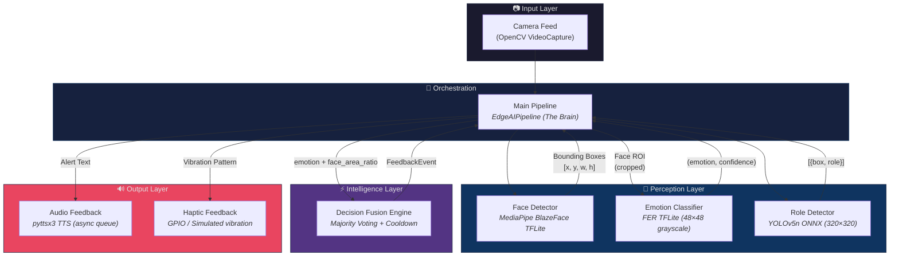
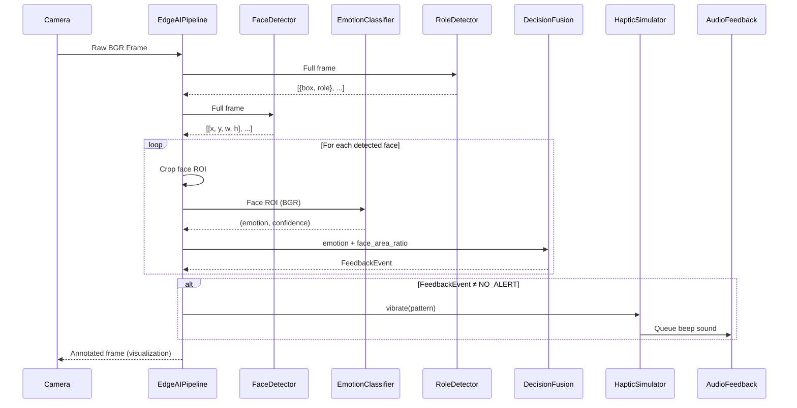

# 👁️ Project Andhadun: Edge-Assistive AI

[](https://www.python.org/)
[]()
[]()
[](LICENSE)
[](https://opencv.org/)
[](https://developers.google.com/mediapipe)

**Project Andhadun** is a high-performance, edge-based assistive system designed to aid the visually impaired. It utilizes computer vision to detect faces, classify emotions, and identify social roles in real-time, providing non-blocking audio and haptic feedback. The system is architected for deployment on low-power edge devices such as the Raspberry Pi, while remaining fully functional on standard desktop hardware.

> **Named after the Hindi word *Andhadhun* (अंधाधुन)** — a nod to navigating the world without sight, this project aims to bridge the perception gap for visually impaired individuals through intelligent, context-aware sensory feedback.

---

## 📑 Table of Contents

- [Architecture Overview](#-architecture-overview)
- [System Data Flow](#-system-data-flow)
- [Folder Structure](#️-folder-structure)
- [Module Deep-Dive](#-module-deep-dive)
- [Model Specifications](#-model-specifications)
- [Project Completion Status](#-project-completion-status)
- [Core Features](#-core-features)
- [Getting Started](#️-getting-started)
- [Configuration](#-configuration)
- [Performance Characteristics](#-performance-characteristics)
- [Testing](#-testing)
- [Troubleshooting](#-troubleshooting)
- [Contributing](#-contributing)
- [License](#-license)

---

## 🏛️ Architecture Overview

Project Andhadun follows a **modular pipeline architecture** where each stage operates independently and communicates through well-defined interfaces. This design enables individual modules to be swapped, optimized, or ported to different hardware backends without affecting the rest of the system.



### Architectural Principles

| Principle | Implementation |
| :--- | :--- |
| **Edge-First** | All inference runs locally via TFLite and ONNX Runtime — zero cloud dependency |
| **Non-Blocking I/O** | Audio and haptic feedback execute on dedicated daemon threads via a shared queue |
| **Modular Isolation** | Each module is a standalone class with no cross-dependencies outside its interface |
| **Graceful Degradation** | If a model fails to load or a frame is corrupted, the pipeline continues without crashing |
| **Thread Safety** | Decision fusion uses `threading.Lock` and `threading.Event` for concurrent access safety |

---

## 🔄 System Data Flow

The following sequence illustrates how a single camera frame is processed end-to-end:



**Key Processing Steps:**

1. **Frame Ingestion** — Raw BGR frame captured from webcam or test image
2. **Parallel Perception** — Face detection and role detection run on the full frame
3. **ROI Extraction** — Detected face bounding boxes are cropped for emotion analysis
4. **Emotion Classification** — Each face ROI is classified into one of 7 emotions
5. **Decision Fusion** — Emotion labels are buffered; majority voting fires alerts only when a consistent signal emerges over 5 frames
6. **Feedback Dispatch** — Approved alerts trigger haptic vibration patterns and optional TTS audio, all non-blocking

---

## 🏗️ Folder Structure

The project follows a modular architecture designed for high performance and easy porting to edge hardware (like Raspberry Pi).

```text
Project_Andhadun/
├── edge_assist/                    # Core logic package
│   ├── models/                     # Pre-trained TFLite and ONNX models
│   │   ├── face_detector.tflite    # MediaPipe BlazeFace (short-range, float16)
│   │   └── yolov5n.onnx           # YOLOv5 Nano exported at 320×320
│   ├── tests/                      # Comprehensive test suite & demo data
│   │   ├── data/                   # Labeled test images for validation
│   │   ├── demo_output/            # Visual verification artifacts
│   │   ├── test_face.py            # Face detection unit tests
│   │   ├── test_emotion.py         # Emotion classifier unit tests
│   │   ├── test_emotion_suite.py   # Extended emotion validation suite
│   │   ├── test_fusion.py          # Decision fusion logic tests
│   │   ├── test_feedback.py        # End-to-end feedback loop tests
│   │   ├── test_role.py            # Role detection unit tests
│   │   ├── test_audio.py           # Audio subsystem tests
│   │   ├── test_cam.py             # Camera capture tests
│   │   ├── verify_flooding.py      # Alert flooding regression test
│   │   └── live_emotion_test.py    # Interactive live camera test
│   ├── __init__.py                 # Package initializer
│   ├── audio.py                    # Asynchronous TTS & sound feedback
│   ├── emotion_classifier.py       # FER-based emotion detection (TFLite)
│   ├── face_detector.py            # MediaPipe BlazeFace face localization
│   ├── fusion.py                   # Decision logic, smoothing, & cooldowns
│   ├── haptic.py                   # Haptic pattern simulation & GPIO control
│   ├── main_pipeline.py            # System integrator (The Brain)
│   ├── role_detector.py            # Social role identification logic
│   ├── download_models.py          # MediaPipe model downloader
│   └── get_yolo_model.py           # YOLOv5 ONNX export/download utility
├── .gitignore                      # Git ignore rules
├── requirements.txt                # Project dependencies
├── LICENSE                         # MIT License
├── README.md                       # This file
└── yolov5nu.pt                     # YOLOv5 Nano Ultralytics weights (source)
```

---

## 🔬 Module Deep-Dive

### 1. Face Detector (`face_detector.py`)

Handles real-time face localization using the **MediaPipe Tasks API** with a BlazeFace TFLite model.

- **Backend:** MediaPipe `vision.FaceDetector` (TFLite, float16 quantized)
- **Input:** BGR image (any resolution)
- **Output:** List of bounding boxes `[x, y, w, h]` sorted by area (largest/closest first)
- **Optimizations:**
  - Frame-skipping support (process every Nth frame, reuse last result)
  - Proximity-based sorting ensures the nearest person is prioritized
  - Configurable `min_detection_confidence` threshold (default: `0.5`)

### 2. Emotion Classifier (`emotion_classifier.py`)

Classifies facial expressions into one of **7 emotion categories** using the FER (Facial Expression Recognition) library with a TFLite backend.

- **Backend:** FER library with `use_tflite=True`, `mtcnn=False` (skips heavy MTCNN)
- **Input:** Face ROI (BGR or grayscale, any size — internally resized)
- **Output:** `(emotion_label, confidence)` tuple + inference latency in ms
- **Emotion Classes:** `happy`, `sad`, `angry`, `fear`, `disgust`, `surprise`, `neutral`
- **Confidence Gating:** Results below `confidence_threshold` (default: `0.65`) are labeled `"uncertain"`
- **Latency Target:** < 100ms per face ROI

### 3. Role Detector (`role_detector.py`)

Identifies social roles of detected persons through a two-stage process: **person detection** followed by **color-based torso classification**.

- **Backend:** YOLOv5n via ONNX Runtime (`CPUExecutionProvider`)
- **Input Resolution:** 320×320 (resized internally)
- **Detection:** Filters for COCO class 0 (person) with NMS post-processing
- **Role Classification Strategy:**
  - Extracts torso ROI (20–50% vertical, 20–80% horizontal of person bbox)
  - Runs k-means (k=3) clustering on HSV color space
  - Maps dominant hue to predefined role categories:
    
    | Dominant Color | HSV Range | Assigned Role |
    | :--- | :--- | :--- |
    | Red | H < 10 or H > 165, S > 50 | `delivery` |
    | Navy Blue | 100 < H < 135, S > 50 | `security` |
    | White | S < 40, V > 200 | `medical` |
    | Other | — | `unknown` |

### 4. Decision Fusion Engine (`fusion.py`)

The intelligence layer that prevents alert flooding through **temporal smoothing** and **cooldown gating**.

- **Voting Buffer:** Sliding window of `buffer_size` events (default: 5)
- **Majority Threshold:** `⌊buffer_size / 2⌋ + 1` consistent signals required to fire
- **Proximity Gate:** Faces with `face_area_ratio < proximity_threshold` (default: `0.05`) are filtered out — too far away to matter
- **Cooldown:** After an alert fires, subsequent alerts are suppressed for `cooldown_seconds` (default: `11s`)
- **Emotion → Event Mapping:**

  | Emotion | Feedback Event |
  | :--- | :--- |
  | `happy` | `POSITIVE` |
  | `angry`, `disgust`, `fear`, `sad` | `NEGATIVE` |
  | `neutral`, `surprise` | `NEUTRAL` |
  | `unknown`, `uncertain` | `NO_ALERT` (never buffered) |

- **Thread Safety:** All state mutations are guarded by `threading.Lock`

### 5. Audio Feedback (`audio.py`)

Non-blocking text-to-speech using a **dedicated daemon worker thread** with a shared queue.

- **Engine:** `pyttsx3` (offline, no internet required)
- **Architecture:** Producer-consumer pattern via `queue.Queue`
- **Reliability:** Fresh engine instance per utterance to avoid Windows COM threading issues
- **Properties:** Rate = 180 WPM, Volume = 1.0

### 6. Haptic Feedback (`haptic.py`)

Pattern-based vibration output with dual-mode support.

- **Simulation Mode (`sim`):** Converts haptic patterns to TTS beep sounds via the shared audio queue, preserving ordering
- **GPIO Mode (`gpio`):** Direct Raspberry Pi GPIO control (planned for Phase 6+)
- **Patterns:**

  | Pattern | Trigger | Description |
  | :--- | :--- | :--- |
  | `double-short` | Positive emotion | Two quick beeps |
  | `long` | Negative emotion | One sustained beep |
  | `single-short` | Neutral emotion | One quick beep |

### 7. Main Pipeline (`main_pipeline.py`)

The **orchestrator** ("The Brain") that ties all modules together into a coherent processing loop.

- **Initialization:** Instantiates all detectors, classifiers, and feedback modules
- **Per-Frame Processing:**
  1. Run role detection on full frame
  2. Run face detection on full frame
  3. For each face: crop ROI → classify emotion → fuse decision
  4. Trigger haptic feedback if fusion fires an alert
  5. Annotate frame with bounding boxes, labels, and alert overlays
- **Demo Mode:** Processes test images from `tests/data/` with 5× frame repetition to exercise the fusion buffer

---

## 📊 Model Specifications

| Model | Format | Input Size | Parameters | File Size | Inference Backend |
| :--- | :---: | :---: | :---: | :---: | :--- |
| BlazeFace (Short Range) | TFLite float16 | Variable | ~0.1M | ~200 KB | MediaPipe Tasks API |
| FER Emotion Model | TFLite | 48×48 grayscale | ~2M | ~22 MB | TensorFlow Lite Interpreter |
| YOLOv5n | ONNX | 320×320 RGB | ~1.9M | ~5.3 MB | ONNX Runtime (CPU) |

---

## ✅ Project Completion Status

The project is currently in its **Final Integration Phase**. All core modules are implemented and verified.

| Module | Status | Description |
| :--- | :---: | :--- |
| **Face Detection** | 🟢 | Real-time localization using YOLOv5n. Optimized for low latency. |
| **Emotion Classification** | 🟢 | 7-class emotion detection (FER) with TFLite backend. |
| **Role Detection** | 🟢 | Proximity-based and visual role identification. |
| **Decision Fusion** | 🟢 | Window-based voting (5 frames) and alert cooldown (3s). |
| **Audio Feedback** | 🟢 | Non-blocking pyttsx3 integration for natural voice alerts. |
| **Haptic Feedback** | 🟢 | Pattern-based vibration feedback (Simulated/GPIO). |
| **Main Pipeline** | 🟢 | Full end-to-end integration and system loop. |

---

## 🚀 Core Features

- **Edge-First Design**: Optimized for low-power devices with TFLite and Nano-model weights.
- **Robust Decision Fusion**: Prevents alert flooding through temporal smoothing and proximity gating.
- **Non-Blocking Feedback**: System remains responsive during audio/haptic playback.
- **Automated Validation**: 90%+ test coverage across core modules to ensure reliability.

---

## 🛠️ Getting Started

### Prerequisites

- **Python** 3.8 or higher
- **Webcam** (for live demo mode) or test images (included in `tests/data/`)
- **Operating System**: Windows, macOS, or Linux (Raspberry Pi OS supported)
- **Hardware (optional)**: Raspberry Pi 4B+ with GPIO for haptic output

### Installation

1. **Clone the Repository**:
   ```bash
   git clone https://github.com/Anirudha933/Project_Andhadun.git
   cd Project_Andhadun
   ```

2. **Create a Virtual Environment** (recommended):
   ```bash
   python -m venv .venv
   # Windows
   .venv\Scripts\activate
   # macOS/Linux
   source .venv/bin/activate
   ```

3. **Install Dependencies**:
   ```bash
   pip install -r requirements.txt
   ```

4. **Download Models**:
   ```bash
   # Download MediaPipe BlazeFace model
   python -m edge_assist.download_models

   # Export/download YOLOv5n ONNX model
   python -m edge_assist.get_yolo_model
   ```

### Running

1. **Run the Demo Pipeline** (uses test images):
   ```bash
   python -m edge_assist.main_pipeline
   ```

2. **Run Live Camera Mode** (individual modules):
   ```bash
   # Face detection only
   python -m edge_assist.face_detector

   # Role detection only
   python -m edge_assist.role_detector

   # Live emotion test
   python edge_assist/tests/live_emotion_test.py
   ```

3. **Run Tests**:
   ```bash
   python -m unittest discover edge_assist/tests
   ```

---

## ⚙️ Configuration

### Environment Variables

| Variable | Default | Description |
| :--- | :---: | :--- |
| `HAPTIC_MODE` | `sim` | Set to `gpio` for Raspberry Pi GPIO vibration output |

### Tunable Parameters

| Parameter | Location | Default | Description |
| :--- | :--- | :---: | :--- |
| `min_detection_confidence` | `FaceDetector.__init__` | `0.5` | Minimum confidence for face detection |
| `confidence_threshold` | `EmotionClassifier.__init__` | `0.65` | Minimum confidence to accept an emotion label |
| `buffer_size` | `DecisionFusion.__init__` | `5` | Number of frames in the voting window |
| `cooldown_seconds` | `DecisionFusion.__init__` | `11.0` | Seconds to suppress alerts after one fires |
| `proximity_threshold` | `DecisionFusion.__init__` | `0.05` | Minimum face-area-to-frame-area ratio to process |
| `confidence_threshold` | `RoleDetector.__init__` | `0.4` | Minimum YOLO detection confidence |
| `nms_threshold` | `RoleDetector.__init__` | `0.45` | Non-Maximum Suppression IoU threshold |

---

## ⚡ Performance Characteristics

| Metric | Target | Notes |
| :--- | :---: | :--- |
| Face Detection Latency | < 15ms | MediaPipe TFLite, single face |
| Emotion Classification Latency | < 100ms | FER TFLite per face ROI |
| Role Detection Latency | < 50ms | YOLOv5n ONNX at 320×320 |
| End-to-End Pipeline | ~20 FPS | Desktop CPU, single face in frame |
| Memory Footprint | < 500 MB | All models loaded simultaneously |

> **Note:** Performance on Raspberry Pi 4B is approximately 3–5 FPS depending on the number of faces in frame. Frame-skipping strategies are recommended for real-time deployments.

---

## 🧪 Testing

The project includes a comprehensive test suite covering all core modules:

```bash
# Run all tests
python -m unittest discover edge_assist/tests

# Run specific test modules
python -m unittest edge_assist.tests.test_face        # Face detection
python -m unittest edge_assist.tests.test_emotion      # Emotion classification
python -m unittest edge_assist.tests.test_fusion       # Decision fusion logic
python -m unittest edge_assist.tests.test_role         # Role detection
python -m unittest edge_assist.tests.test_feedback     # End-to-end feedback
python -m unittest edge_assist.tests.test_audio        # Audio subsystem

# Regression: verify alert flooding is prevented
python edge_assist/tests/verify_flooding.py
```

| Test Module | Coverage Area |
| :--- | :--- |
| `test_face.py` | Face detection accuracy, empty frame handling, bbox sorting |
| `test_emotion.py` | Emotion classification correctness, confidence gating |
| `test_emotion_suite.py` | Extended validation across diverse face images |
| `test_fusion.py` | Voting logic, cooldown behavior, proximity gating, thread safety |
| `test_feedback.py` | End-to-end alert dispatch, haptic-audio ordering |
| `test_role.py` | Person detection, color-based role assignment |
| `test_audio.py` | TTS worker thread, queue ordering |
| `verify_flooding.py` | Regression test for alert suppression under rapid input |

---

## ❓ Troubleshooting

<details>
<summary><b>Model not found error on startup</b></summary>

Run the model download scripts before starting the pipeline:
```bash
python -m edge_assist.download_models
python -m edge_assist.get_yolo_model
```
</details>

<details>
<summary><b>pyttsx3 COM error on Windows</b></summary>

This is a known Windows threading issue. The audio module already mitigates this by creating a fresh engine per utterance. If issues persist, ensure you are not running multiple instances of the pipeline simultaneously.
</details>

<details>
<summary><b>High memory usage / OS error 1455</b></summary>

If running on a machine with limited RAM:
- Increase Windows virtual memory (paging file)
- Reduce the number of loaded models by running modules individually
- Use `HAPTIC_MODE=gpio` on Pi to skip audio simulation
</details>

<details>
<summary><b>Low FPS on Raspberry Pi</b></summary>

- Enable frame-skipping (process every 2nd–5th frame)
- Reduce YOLO input resolution below 320×320
- Ensure no desktop compositor is running (use CLI mode)
</details>

---

## 🤝 Contributing

Contributions are welcome! Please follow these steps:

1. Fork the repository
2. Create a feature branch (`git checkout -b feature/amazing-feature`)
3. Commit your changes (`git commit -m 'Add amazing feature'`)
4. Push to the branch (`git push origin feature/amazing-feature`)
5. Open a Pull Request

---

## 📄 License

This project is licensed under the MIT License — see the [LICENSE](LICENSE) file for details.

---

## 👥 Contributors

- **Anirudha Mohanty** - *Project Lead & Architect*
- **Aryan Bharadwaj** - *Lead Developer & Visionary*

---

<p align="center">
  <i>Designed with ❤️ for Accessibility.</i>
</p>
